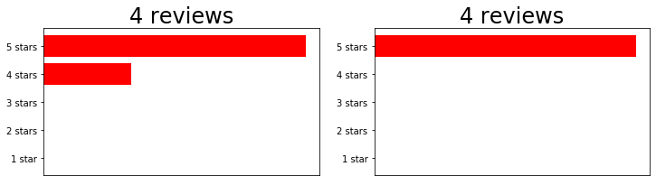
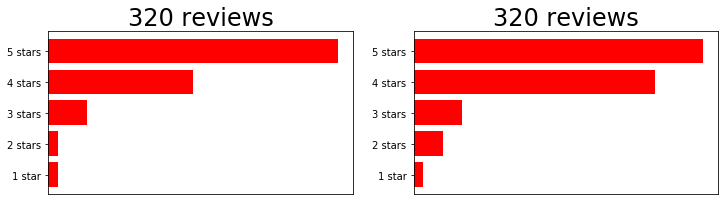
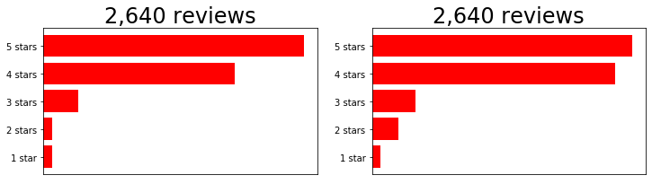

# Differential expression & cluster annotation

## Introduction

Now that we've assigned cells into clusters, we'd like to understand what makes each cluster different from other cells in the dataset, or to annotate clusters according to their cell types (as has been previously done for this dataset).  

There are several approaches to this task:  

* Look for upregulation of marker genes for cell types of interest (compared to the rest of the dataset)  
* Compare the complete gene expression profiles between groups  
* Use automated methods to compare cells of interest to databases of cell type expression profiles to combine clustering and annotation  

Automated methods are a promising advance, but are not yet able to replace careful human curation. 

For well-defined cell types, we expect marker genes to show large differences in expression between the cell type of interest and the rest of the dataset, allowing us to use simple methods. We'll focus on this approach for this workshop, while building intuition that is broadly applicable to other approaches.


## Comparing distributions

Unlike bulk RNA-seq, we generally have a large number of samples (i.e. cells) for each group we are comparing in single-cell experiments. Thus we can take advantage of the whole distribution of expression values in each group to identify differences between groups rather than only comparing estimates of mean-expression as is standard for bulk RNASeq.

There are two main approaches to comparing distributions: parametric and nonparametric. 

For parametric comparisons, we can infer parameters of a distribution so that it matches the expression values in each group as best as possible. We can then ask whether there are significant differences in the parameters that best describe each group. 

Alternatively, we can use a non-parametric test which does not assume that expression values follow any particular distribution. Non-parametric tests generally convert observed expression values to ranks and test whether the distribution of ranks for one group are signficantly different from the distribution of ranks for the other group. However, some non-parametric methods fail in the presence of a large number of tied values, such as the case for dropouts (zeros) in single-cell RNA-seq expression data. Moreover, if the conditions for a parametric test hold, then it will typically be more powerful than a non-parametric test.

Here, we'll demonstrate N approaches to parametric comparisons between groups.


### Exercise: building intuition about distributions

Let's revisit some foundational statistics to tap into some intuition you use all the time. 

Say you're looking for a restaurant for dinner, and you are comparing two different restaurant options. If you see reviews that look like this, would you think one is better than the other? How sure are you? 



Now, what if you saw these sets of reviews? Do you think one is better? 



Finally, what about this set of reviews?




Chat with your neighbor: what factors about the reviews influence your assessment of which restaurant is better? How could this apply to your scRNAseq data?

<p>

<details>
    <summary><h3>Discussion</h3></summary>
    Looking at the first set of reviews, my conclusion would be "Maybe the right one is better? But there aren't many reviews yet, so I'm not sure." 
    <p>
    Once we look at the second set of reviews, I would have more confidence that the restaurant on the right is superior, because there are more reviews. 
    <p>
    Looking at the final set of reviews, we can be quite confident that there is a "real" difference in the mean review score, but the magnitude of this difference is small. 
    <p>
    This is a very important distinction: a t-test compares our data to the null hypothesis that the means of two distributions are **equal**. This accounts for the mean, standard deviation, and sample size of the two distributions. However, a p-value alone does not tell us anything about the *magnitude* of that difference: with large N, even very small (and biologically meaningless) differences in expression values can still return very "statistically significant" p-values. 


## Load data

Let's apply this intuition to our data. We'll continue working with the mouse brain data with assigned clusters. 


<div markdown="1" class="cell code_cell">
<div class="input_area" markdown="1">
```python
import scanpy as sc
import numpy as np
import matplotlib.pyplot as plt
%matplotlib inline

adata = sc.read('../data/brain_clusters.h5ad')

```
</div>

</div>


### Important note! For differential expression, we need to use the _raw_ values stored in `adata.raw`.

With differential expression, we want to account for both the center and spread of the expression in each group. Recall that when we normalized our values, we standardized the distribution of each gene across cells to be centered at 0 and scaled with variance 1. So, when calculating differential expression, we should use the raw values (post-QC, pre-normalization). We saved these in `adata.raw` earlier on. 


This has several tricky questions embedded in it:  
* What constitutes a cell type? With what granularity? (E.g., lymphocytes > T cells > CD4+ T cells)  
* How does cell state interact with cell type? (E.g., when annotating in/activated T cells)  
* 

