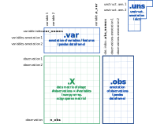

# Tabula Muris

## Introduction

To give you hands-on experience analyzing a single-cell RNASeq dataset from start to finish, we will be using data from [Tabula Muris](https://tabula-muris.ds.czbiohub.org/) as an example. The Tabula Muris is a collaborative effort to profile every mouse tissue at a single-cell level. The full dataset includes both high throughput but low-coverage 10X data and lower throughput but high-coverage Smartseq2 data.

For this workshop, we will be using the Smartseq2 data from the mouse brain. This data consists of:  
1. an __expression matrix__ where each column corresponds to a gene (or transcript) and each row corresponds to a single cell  
2. a table of __metadata__ describing each cell

## Downloading the data

You can find the prepared expression matrix and metadata [here](INSERT LINK). You should save these files in the directory `scRNA-couse/content/data/`.

## Reading the data

We can now read in the count matrix from the comma-separated file. Then inspect the resulting dataframe:


<div markdown="1" class="cell code_cell">
<div class="input_area" markdown="1">
```python
import pandas as pd ## load in the pandas library for working with dataframes

```
</div>

</div>


<div markdown="1" class="cell code_cell">
<div class="input_area" markdown="1">
```python
## tell pandas to make a new DataFrame with the contents of `brain_counts.csv`. This might take a minute.
count_dataframe = pd.read_csv('../data/brain_counts.csv', # where to find the data
                              index_col=0) # use the first column to label the rows (the 'index')

## print the first 5 rows of our dataframe
print(count_dataframe.head()) 

```
</div>

<div class="output_wrapper" markdown="1">
<div class="output_subarea" markdown="1">
{:.output_stream}
```
                         0610005C13Rik  0610007C21Rik  0610007L01Rik  \
A1.B003290.3_38_F.1.1                0            125             16   
A1.B003728.3_56_F.1.1                0              0              0   
A1.MAA000560.3_10_M.1.1              0            348              0   
A1.MAA000564.3_10_M.1.1              0             41             36   
A1.MAA000923.3_9_M.1.1               0             53              0   

                         0610007N19Rik  0610007P08Rik  0610007P14Rik  \
A1.B003290.3_38_F.1.1                0              0              0   
A1.B003728.3_56_F.1.1                0              0            324   
A1.MAA000560.3_10_M.1.1              0              0              5   
A1.MAA000564.3_10_M.1.1              0              0             24   
A1.MAA000923.3_9_M.1.1               0              0              0   

                         0610007P22Rik  0610008F07Rik  0610009B14Rik  \
A1.B003290.3_38_F.1.1                0              0              0   
A1.B003728.3_56_F.1.1                0              0              0   
A1.MAA000560.3_10_M.1.1              0              0              0   
A1.MAA000564.3_10_M.1.1              0              0              0   
A1.MAA000923.3_9_M.1.1               0              0              0   

                         0610009B22Rik  ...  Zxdb  Zxdc  Zyg11a  Zyg11b  Zyx  \
A1.B003290.3_38_F.1.1                0  ...     0     0       0       0    0   
A1.B003728.3_56_F.1.1                0  ...     0     0       0       0    0   
A1.MAA000560.3_10_M.1.1              0  ...     0     0       0       0    0   
A1.MAA000564.3_10_M.1.1             14  ...     0     0       0       0  125   
A1.MAA000923.3_9_M.1.1               0  ...     0     0       0      81    0   

                         Zzef1  Zzz3  a  l7Rn6  zsGreen_transgene  
A1.B003290.3_38_F.1.1        0     0  0     54                  0  
A1.B003728.3_56_F.1.1        0     0  0      0                  0  
A1.MAA000560.3_10_M.1.1    195     0  0    113                  0  
A1.MAA000564.3_10_M.1.1      0     1  0      0                  0  
A1.MAA000923.3_9_M.1.1       0     0  0      0                  0  

[5 rows x 23433 columns]
```
</div>
</div>
</div>


### Exercise

What do the column names represent? What do the row names represent? How many cells and genes are in this dataset?

Hint: need some help? Try `help(pd.DataFrame.shape)`.

<p>
<details>
<summary><h3>Solution</h3></summary>
The column names represent genes. 
The row names represent unique cell identifiers that were assigned by the authors of the dataset.
<p>
We can find out how many genes and cells are in the dataset by asking for its <code>shape</code>:  <br>
<code>print(count_dataframe.shape)</code><br>
gives:<br>
<code>(3401, 23433)</code>
<p>
which represents <code>(N rows, N columns)</code>.
</details>


## Reading the metadata

The authors have also provided metadata describing each cell. This metadata is stored in a separate file, `brain_metadata.csv`. We can load it into a dataframe and inspect it, just like we did for the count data. 

### Exercise

Load the metadata from the csv file into a pandas dataframe called `metadata_dataframe`. Does it have the same dimensions and index as the `counts_dataframe`?

<p>
<details>
<summary><h3>Solution</h3></summary>
First, we need to load in the metadata.<br>
<code>metadata_dataframe = pd.read_csv('../data/brain_metadata.csv', # where to find the data
                           index_col=0) # use the first column as the index</code>
    
<p>
Let's take a peak at the resulting dataframe to make sure it looks correct. <br>
<code>print(metadata_dataframe.shape)</code><br>
<code>>>> (3401, 5)</code><br>
We have 5 columns of information about 3,401 cells. Sounds reasonable.
    
<p>
Let's take a closer look and inspect the first few rows:<br>
<code>print(metadata_dataframe.head())</code><br>
<code>>>>                        cell_ontology_class    subtissue mouse.sex mouse.id  \
cell                                                                          
A1.B003290.3_38_F.1.1             astrocyte     Striatum         F   3_38_F   
A1.B003728.3_56_F.1.1             astrocyte     Striatum         F   3_56_F   
A1.MAA000560.3_10_M.1.1     oligodendrocyte       Cortex         M   3_10_M   
A1.MAA000564.3_10_M.1.1    endothelial cell     Striatum         M   3_10_M   
A1.MAA000923.3_9_M.1.1            astrocyte  Hippocampus         M    3_9_M   
                        plate.barcode  
cell                                   
A1.B003290.3_38_F.1.1         B003290  
A1.B003728.3_56_F.1.1         B003728  
A1.MAA000560.3_10_M.1.1     MAA000560  
A1.MAA000564.3_10_M.1.1     MAA000564  
A1.MAA000923.3_9_M.1.1      MAA000923</code>
</details>


### Exercise

To get a sense for what is in this dataset, let's look at the summary of each metadata column. 

1. How many cells from each `subtissue` label are in this dataset? <br>
_Hint: try running `help(pd.value_counts())` to get started_  
<p>
2. Using a `for` loop, repeat this counting procedure to summarize each of the metadata columns.  <br>
_Hint: you can access all the column names in the dataframe with `columns = metadata_dataframe.columns.values`_  


<p>
<details>
<summary><h3>Solution</h3></summary>
1. We can count the number of times each value appears in a column like this:<br>
    <code>print(pd.value_counts(metadata_dataframe['subtissue']))</code><br>
    <code>>>>        
Cortex         1149
Hippocampus     976
Striatum        723
Cerebellum      553
Name: subtissue, dtype: int64</code>
    <p>
2. To repeat this for each column in the dataframe, we can use a <code>for</code> loop:<br>
<code>for column in metadata_dataframe.columns.values:
    print(pd.value_counts(metadata_dataframe[column]))</code>
</details>


## Building an AnnData object


We now have two dataframes, containing the counts and metadata from the Tabula Muris brain dataset. To keep these organized, we'll use a **data structure** called **AnnData**. AnnData stands for "annotated data," and is the standard format used by the analysis library, **SCANPY**. 

AnnData uses some generalized vocabulary to describe cells and genes: they refer to cells as **observations** and genes as **variables**. This data structure has four areas where we can store information:  



`AnnData.X` stores the count matrix  
`AnnData.obs` stores metadata about the observations (cells)  
`AnnData.var` stores metadata about the variables (genes)  
`AnnData.uns` stores any additional, unstructured information we decide to attach later  


Here, we have a count matrix and metadata that describes each cell, so we will use the `.X` and `.obs` portions of the AnnData structure. 


<div markdown="1" class="cell code_cell">
<div class="input_area" markdown="1">
```python
import scanpy as sc # import the scanpy library that tells Python how an AnnData data structure works

```
</div>

</div>


<div markdown="1" class="cell code_cell">
<div class="input_area" markdown="1">
```python
# help(sc.AnnData)
adata = sc.AnnData(X = count_dataframe, obs = metadata_dataframe)
print(adata)

```
</div>

<div class="output_wrapper" markdown="1">
<div class="output_subarea" markdown="1">
{:.output_stream}
```
AnnData object with n_obs × n_vars = 3401 × 23433 
    obs: 'cell_ontology_class', 'subtissue', 'mouse.sex', 'mouse.id', 'plate.barcode'
```
</div>
</div>
</div>


### Labeling spike-ins
Because this is smartseq2 data, we may have spike-ins. These gene names start with `ERCC`. We can label them in `adata.var` as a gene annotation.


<div markdown="1" class="cell code_cell">
<div class="input_area" markdown="1">
```python
is_spike_in = {}
number_of_spike_ins = 0

for gene_name in adata.var_names:
    if 'ERCC' in gene_name:
        is_spike_in[gene_name] = True # record that we found a spike-in
        number_of_spike_ins += 1 # bump the counter
    else:
        is_spike_in[gene_name] = False # record that this was not a spike-in
        
adata.var['ERCC'] = pd.Series(is_spike_in) # because the index of adata.var and the keys of is_spike_in match, anndata will take care of matching them up
print('found this many spike ins: ', number_of_spike_ins)

```
</div>

<div class="output_wrapper" markdown="1">
<div class="output_subarea" markdown="1">
{:.output_stream}
```
found this many spike ins:  92
```
</div>
</div>
</div>


Now that we've finished building our AnnData object, we can save it in a file for later use like so:


<div markdown="1" class="cell code_cell">
<div class="input_area" markdown="1">
```python
adata.write('../data/brain_raw.h5ad') ## the h5ad extension is AnnData-specific

```
</div>

</div>

