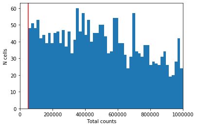
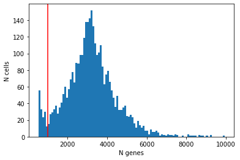
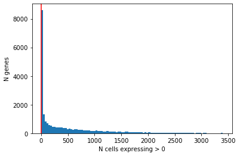
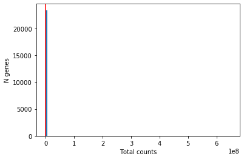

# Introduction

Once we have our expression matrix, it should be examined to remove poor quality cells which were not detected in the initial processing of the raw reads. Failure to remove low quality cells at this
stage may add technical noise which has the potential to obscure
the biological signals of interest in the downstream analysis. 

Since there is currently no standard method for performing scRNAseq, the expected values for the various QC measures that will be presented here can vary substantially from experiment to experiment. Thus, to perform QC we will be looking for cells which are outliers with respect to the rest of the dataset rather than comparing to independent quality standards. Consequently, care should be taken when comparing quality metrics across datasets collected using different protocols.


#  Dataset

We'll continue working with the Tabula Muris brain data that we prepared earlier: 


<div markdown="1" class="cell code_cell">
<div class="input_area" markdown="1">
```python
import scanpy as sc # import scanpy to handle our AnnData 
import pandas as pd # import pandas to handle dataframes
import matplotlib.pyplot as plt # import matplotlib to visualize our qc metrics

# magic incantation to help matplotlib work with our jupyter notebook
%matplotlib inline 

```
</div>

</div>


<div markdown="1" class="cell code_cell">
<div class="input_area" markdown="1">
```python
adata = sc.read('../data/brain_raw.h5ad')

```
</div>

</div>


## Computing quality control metrics
We'll compute quality metrics and then filter cells and genes accordingly.

The `calculate_qc_metrics` function returns two dataframes: one containing quality control metrics about cells, and one containing metrics about genes. This function is housed in the 'preprocessing' portion of the SCANPY library, which you can read more about [here](https://icb-scanpy.readthedocs-hosted.com/en/stable/api/index.html#module-scanpy.pp).


<div markdown="1" class="cell code_cell">
<div class="input_area" markdown="1">
```python
qc = sc.pp.calculate_qc_metrics(adata, qc_vars = ['ERCC'])# this returns a tuple of (cell_qc_dataframe, gene_qc_dataframe)
                                 # ask for the percentage of reads from spike ins
                                
cell_qc_dataframe = qc[0]
gene_qc_dataframe = qc[1]

print('This is the cell quality control dataframe:')
print(cell_qc_dataframe.head())

print('\n\nThis is the gene quality control dataframe')
print(gene_qc_dataframe)

```
</div>

<div class="output_wrapper" markdown="1">
<div class="output_subarea" markdown="1">
{:.output_stream}
```
This is the cell quality control dataframe:
                         n_genes_by_counts  log1p_n_genes_by_counts  \
index                                                                 
A1.B003290.3_38_F.1.1                 3359                 8.119696   
A1.B003728.3_56_F.1.1                 1718                 7.449498   
A1.MAA000560.3_10_M.1.1               3910                 8.271548   
A1.MAA000564.3_10_M.1.1               4352                 8.378621   
A1.MAA000923.3_9_M.1.1                2248                 7.718241   

                         total_counts  log1p_total_counts  \
index                                                       
A1.B003290.3_38_F.1.1        390075.0           12.874097   
A1.B003728.3_56_F.1.1        776439.0           13.562474   
A1.MAA000560.3_10_M.1.1     1616087.0           14.295519   
A1.MAA000564.3_10_M.1.1      360004.0           12.793873   
A1.MAA000923.3_9_M.1.1       290282.0           12.578611   

                         pct_counts_in_top_50_genes  \
index                                                 
A1.B003290.3_38_F.1.1                     25.884766   
A1.B003728.3_56_F.1.1                     43.051933   
A1.MAA000560.3_10_M.1.1                   44.066006   
A1.MAA000564.3_10_M.1.1                   41.650926   
A1.MAA000923.3_9_M.1.1                    63.392494   

                         pct_counts_in_top_100_genes  \
index                                                  
A1.B003290.3_38_F.1.1                      32.847017   
A1.B003728.3_56_F.1.1                      52.912721   
A1.MAA000560.3_10_M.1.1                    51.514553   
A1.MAA000564.3_10_M.1.1                    48.958623   
A1.MAA000923.3_9_M.1.1                     69.136908   

                         pct_counts_in_top_200_genes  \
index                                                  
A1.B003290.3_38_F.1.1                      42.219573   
A1.B003728.3_56_F.1.1                      65.313309   
A1.MAA000560.3_10_M.1.1                    60.164211   
A1.MAA000564.3_10_M.1.1                    56.997422   
A1.MAA000923.3_9_M.1.1                     77.168753   

                         pct_counts_in_top_500_genes  total_counts_ERCC  \
index                                                                     
A1.B003290.3_38_F.1.1                      59.472666            10201.0   
A1.B003728.3_56_F.1.1                      87.315423            67351.0   
A1.MAA000560.3_10_M.1.1                    74.451190            29870.0   
A1.MAA000564.3_10_M.1.1                    69.736170             2592.0   
A1.MAA000923.3_9_M.1.1                     90.522320            11002.0   

                         log1p_total_counts_ERCC  pct_counts_ERCC  
index                                                              
A1.B003290.3_38_F.1.1                   9.230339         2.615138  
A1.B003728.3_56_F.1.1                  11.117688         8.674345  
A1.MAA000560.3_10_M.1.1                10.304644         1.848292  
A1.MAA000564.3_10_M.1.1                 7.860571         0.719992  
A1.MAA000923.3_9_M.1.1                  9.305923         3.790107  


This is the gene quality control dataframe
                   n_cells_by_counts  mean_counts  log1p_mean_counts  \
index                                                                  
0610005C13Rik                     28     0.118201           0.111721   
0610007C21Rik                   2399   206.211990           5.333742   
0610007L01Rik                    961    35.938549           3.609256   
0610007N19Rik                    272     6.498383           2.014687   
0610007P08Rik                    582    16.328728           2.852366   
...                              ...          ...                ...   
Zzef1                            937    29.685974           3.423806   
Zzz3                             992    27.208467           3.339622   
a                                 10     0.022052           0.021813   
l7Rn6                           1145    48.354897           3.899037   
zsGreen_transgene                  0     0.000000           0.000000   

                   pct_dropout_by_counts  total_counts  log1p_total_counts  
index                                                                       
0610005C13Rik                  99.176713         402.0            5.998937  
0610007C21Rik                  29.461923      701327.0           13.460731  
0610007L01Rik                  71.743605      122227.0           11.713643  
0610007N19Rik                  92.002352       22101.0           10.003424  
0610007P08Rik                  82.887386       55534.0           10.924768  
...                                  ...           ...                 ...  
Zzef1                          72.449280      100962.0           11.522510  
Zzz3                           70.832108       92536.0           11.435364  
a                              99.705969          75.0            4.330733  
l7Rn6                          66.333431      164455.0           12.010398  
zsGreen_transgene             100.000000           0.0            0.000000  

[23433 rows x 6 columns]
```
</div>
</div>
</div>


# Quality control for cells

## Library size
First, we consider the total number of reads detected per cell.
Cells with few reads are likely to have been broken or failed to capture a cell, and should thus be removed.


<div markdown="1" class="cell code_cell">
<div class="input_area" markdown="1">
```python
plt.hist(cell_qc_dataframe['total_counts'], bins=1000)
plt.xlabel('Total counts')
plt.ylabel('N cells')
plt.axvline(50000, color='red')
plt.xlim(0,1e6) # Try plotting with and without scaling the x-axis. When is this helpful?

```
</div>

<div class="output_wrapper" markdown="1">
<div class="output_subarea" markdown="1">


{:.output_data_text}
```
(0, 1000000.0)
```


</div>
</div>
<div class="output_wrapper" markdown="1">
<div class="output_subarea" markdown="1">

{:.output_png}


</div>
</div>
</div>


We have a few cells with fewer than 50,000 reads; we'll remove these downstream. 


## Detected genes

In addition to ensuring sufficient sequencing depth for each sample, we also want to make sure that the reads are distributed across the transcriptome. Thus, we count the total number of unique genes detected in each sample.


<div markdown="1" class="cell code_cell">
<div class="input_area" markdown="1">
```python
plt.hist(cell_qc_dataframe['n_genes_by_counts'], bins=100)
plt.xlabel('N genes')
plt.ylabel('N cells')
plt.axvline(1000, color='red')

```
</div>

<div class="output_wrapper" markdown="1">
<div class="output_subarea" markdown="1">


{:.output_data_text}
```
<matplotlib.lines.Line2D at 0x104b67450>
```


</div>
</div>
<div class="output_wrapper" markdown="1">
<div class="output_subarea" markdown="1">

{:.output_png}


</div>
</div>
</div>


From the plot we conclude that most cells have between ~1,000-5,000 detected genes,
which is typical for smartseq2 data. However, this varies by
experimental protocol and sequencing depth. 

The most notable feature in the above plot is the little peak on the left hand side of the
distribution. If detection rates were equal across the cells then the
distribution should be approximately normal. Thus, we will remove those
cells in the tail of the distribution (fewer than ~1000 detected genes).


## Spike-ins

Another measure of cell quality is the ratio between ERCC spike-in RNAs and endogenous RNAs. This ratio can be used to estimate the total amount of RNA in the captured cells. Cells with a high level of spike-in RNAs had low starting amounts of RNA, likely due to the cell being dead or stressed which may result in the RNA being degraded.


### Exercise

Plot the distribution of `pct_counts_ERCC` in this dataset. What do you think is a reasonable threshold? 

<p>
<details>
<summary><h3>Solution</h3></summary>
<code>plt.hist(cell_qc_dataframe['pct_counts_ERCC'], bins=1000)
plt.xlabel('Percent counts ERCC')
plt.ylabel('N cells')
plt.axvline(10, color='red')</code>
<p>    
Placing a threshold is always a judgement call. Here, the majority of cells have less than 10% ERCC counts, but there's a long tail of cells that have very high spike-in counts; these are likely dead cells and should be removed. 
</details>


## Cell filtering

Now we can define a cell filter based on our findings:


There isn't an automatic function for removing cells with a high percentage of ERCC reads, but we can use a _mask_ to remove them like so:


<div markdown="1" class="cell code_cell">
<div class="input_area" markdown="1">
```python
low_ERCC_mask = (cell_qc_dataframe['pct_counts_ERCC'] < 10)
adata = adata[low_ERCC_mask]

```
</div>

</div>


### Exercise

Use the SCANPY function `sc.pp.filter_cells()` to filter cells with fewer than 50,000 reads. Repeat to remove those with fewer than 750 genes detected. How many cells does this remove?  
_Hint: start with the Parameters list in `help(sc.pp.filter_cells)`

<p>
<details>
<summary><h3>Solution</h3></summary>
<code>print('Started with: \n', adata)
sc.pp.filter_cells(adata, min_genes = 750)
sc.pp.filter_cells(adata, min_counts = 50000)
print('Finished with: \n', adata)</code>
</details>


## Quality control for genes

It is typically a good idea to remove genes whose expression level is considered __"undetectable"__. We define a gene as  detectable if at least two cells contain more than 5 reads from the gene. However, the threshold strongly depends on the sequencing depth. It is important to keep in mind that genes must be filtered after cell filtering since some genes may only be detected in poor quality cells.


<div markdown="1" class="cell code_cell">
<div class="input_area" markdown="1">
```python
plt.hist(gene_qc_dataframe['n_cells_by_counts'], bins=100)
plt.xlabel('N cells expressing > 0')
plt.ylabel('N genes')
plt.axvline(2, color='red')

```
</div>

<div class="output_wrapper" markdown="1">
<div class="output_subarea" markdown="1">


{:.output_data_text}
```
<matplotlib.lines.Line2D at 0x1a29ceccd0>
```


</div>
</div>
<div class="output_wrapper" markdown="1">
<div class="output_subarea" markdown="1">

{:.output_png}


</div>
</div>
</div>


<div markdown="1" class="cell code_cell">
<div class="input_area" markdown="1">
```python
plt.hist(gene_qc_dataframe['total_counts'], bins=100)
plt.xlabel('Total counts')
plt.ylabel('N genes')

plt.axvline(10, color='red')
# plt.ylim(0,1000) # try plotting with and without restricting the axis scales. Why is this sometimes helpful?

```
</div>

<div class="output_wrapper" markdown="1">
<div class="output_subarea" markdown="1">


{:.output_data_text}
```
<matplotlib.lines.Line2D at 0x1a320a00d0>
```


</div>
</div>
<div class="output_wrapper" markdown="1">
<div class="output_subarea" markdown="1">

{:.output_png}


</div>
</div>
</div>


### Exercise

Use the SCANPY function `sc.pp.filter_genes()` to filter genes according to the criteria above. How many genes does this remove?  
_Hint: start with the Parameters list in `help(sc.pp.filter_genes)`

<p>
<details>
<summary><h3>Solution</h3></summary>
<code>print('Started with: \n', adata)
sc.pp.filter_genes(adata, min_cells = 2)
sc.pp.filter_genes(adata, min_counts = 10)
print('Finished with: \n', adata)</code>
</details>


### Save the data


<div markdown="1" class="cell code_cell">
<div class="input_area" markdown="1">
```python
# print(adata) ## Final dimensions of the QC'd dataset
adata.write('../data/brain_qc.h5ad')

```
</div>

</div>


## Big Exercise

Load a demo dataset with `pbmc = sc.read('../data/pbmc3k.h5ad')`, which profiles 3,000 peripheral blood mononuclear cells.
Perform exactly the same QC analysis with this dataset. Compare your results to ours (below).


<div markdown="1" class="cell code_cell">
<div class="input_area" markdown="1">
```python
pbmc = sc.read('../data/pbmc3k.h5ad')

```
</div>

</div>


# Fill me in

