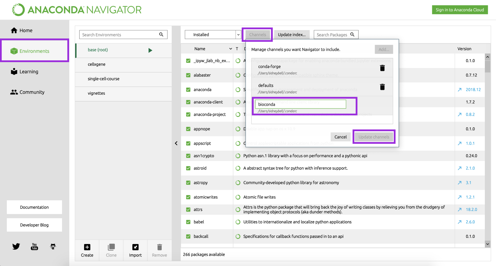
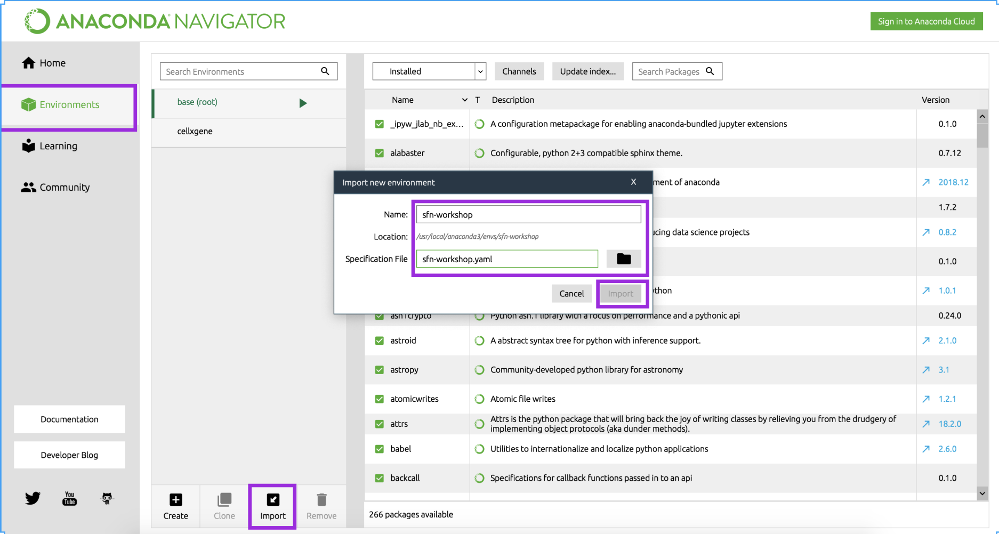
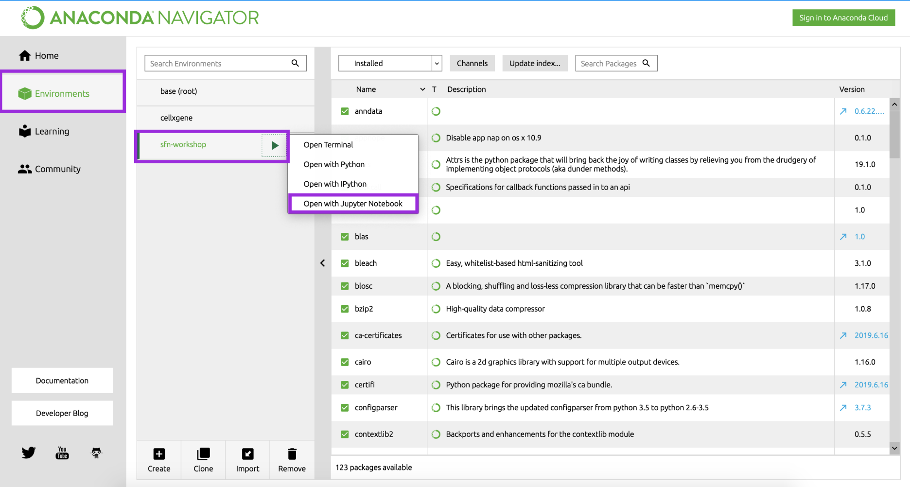
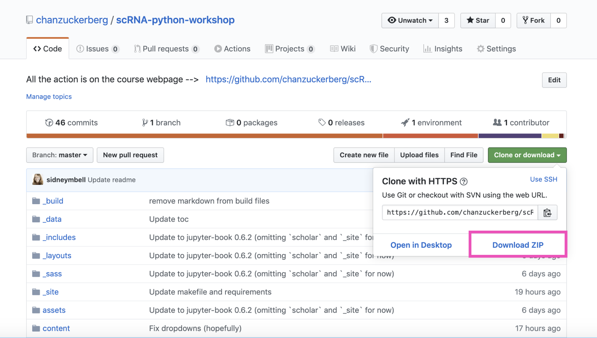

# Setup

## Format

The workshop consists of explanatory discussions interspersed with hands-on exercises. We strongly encourage you to bring a laptop with all required packages installed in order to fully participate. We will also have office hours with CZI computational biology staff available in the morning to help troubleshoot any installation issues before class begins.

## Installation guide (before class)

### 1. Install Python via Anaconda

Even if you have previously installed Python, please install [Anaconda](https://docs.anaconda.com/anaconda/install/) for **Python version 3** (available on OSX, Linux, and Windows). You can simply click through the install wizard (no customization required, all the defaults are fine).

Anaconda is _package manager_, which means that it helps coordinate your Python installation and related _packages_ (useful code written by other people for performing specific tasks) for you so that you have a consistent _environment_ (the version of Python and the version of the code in each package that your computer looks at when doing your analysis).

You should now see an icon for "Anaconda Navigator" in your Applications folder (mac) or the Start menu (Windows). Please contact the instructors if you do not see this icon!

## 2. Install required packages (for **Mac OS**)  
### 2A. Install Bioconda

Not everyone who uses Anaconda is a biologist. As a result, some biology-specific packages are only available in the Bioconda _channel_ (collection of packages).

- Open Anaconda Navigator.
- Click on `Environments` in the left sidebar
- Click on `Channels` in the top middle of the screen
- Click on `Add...`
- In the bottom text box, type `bioconda` and press `Enter`
- Press `Update channels`

### 2B. Download the course config file

To handle installation of all the Python packages required for the workshop (both days, all tracks), we have prepared a configuration file that tells Anaconda how to configure your environment.

- Download the configuration file called [`sfn-workshop-mac.yml` here](https://drive.google.com/a/chanzuckerberg.com/file/d/1UdDiD2WYBfyJnO2CDUIRhpzpHPrqZHve/view?usp=sharing). Save it an a spot you'll remember.
- Open Anaconda Navigator
- Click on `Environments` in the left sidebar
- Click on `Import` in the bottom left
- Enter `sfn-workshop` as the Name, and browse for the `sfn-workshop-mac.yaml` file you just downloaded
- Press `Import`

## 2. Install required packages (for **windows**)
### 2A. Download the course config file

To handle installation of all the Python packages required for the workshop (both days, all tracks), we have prepared a configuration file that tells Anaconda how to configure your environment.

- Download the configuration file called [`sfn-workshop-windows.yml` here](https://drive.google.com/a/chanzuckerberg.com/file/d/1GQGx3DnGRtrxpXAf-iFgREX75TnmbPMg/view?usp=sharing). Save it an a spot you'll remember.
- Open Anaconda Navigator
- Click on `Environments` in the left sidebar
- Click on `Import` in the bottom left
- Enter `sfn-workshop` as the Name, and browse for the `sfn-workshop-windows.yaml` file you just downloaded
- Press `Import`

### 2B. Install scanpy (**for Windows users in the single-cell track only**)  

- Click on the green play button next to the `sfn-workshop` and choose 'Open terminal'  
- Enter `python3 -m pip install scanpy` and press `Enter`

## 3. Check your installation

1. Open Anaconda Navigator
2. Click on `Environments` in the left sidebar
3. Select the `sfn-workshop` environment from the list. This may take several minutes.
4. Click on the green `play` button that appears
5. Select `Open with Jupyter Notebook` from the list

You should get a browser tab that says "Jupyter" at the top and lists all the files on your computer. This might not seem like much, but is all you need to get started! :)

### **If this does not work, please come to office hours before class so the CZI computational biology team can help you**

### 4. Download course files

#### For the imaging track

Go to [https://github.com/sofroniewn/2019-ndcn-comp-bio-imaging](https://github.com/sofroniewn/2019-ndcn-comp-bio-imaging)

#### For the single cell track

Go to [https://github.com/chanzuckerberg/scRNA-python-workshop](https://github.com/chanzuckerberg/scRNA-python-workshop)

#### Clone or download contents

If you are comfortable cloning a repository with git, we encourage you to do so. Otherwise, click the green "clone or download" button and choose "download zip". We encourage you to do this the evening before class, as we may make some last-minute updates to the material.

### 5. Bonus: install fun visualization tools (optional)

1. Open a terminal window (Mac: Applications > Utilities > Terminal; Windows: Start > Windows System > Command Prompt)

#### For the imaging track:

2. In the terminal window, copy and paste the following and press `Enter`:

   `python3 -m pip install napari`

To test your installation of napari, type `napari` in the next terminal line and press `Enter`. You should see an application window open up.

#### For the single-cell analysis track:

2. In the terminal window, copy and paste the following and press `Enter`:

   `python3 -m pip install cellxgene`

To test your installation of cellxgene, type `cellxgene` in the next terminal line and press `Enter`. You should see something like this:  
<code>Usage: cellxgene [OPTIONS] COMMAND [ARGS]...  
Options:  
--version Show the version and exit.  
--help Show this message and exit.  
Commands:  
launch Launch the cellxgene data viewer.  
prepare Preprocesses data for use with cellxgene.</code>

### **If this does not work, and you would like to try out the visualization tools in class, please come to office hours before class so we can help you.**
